<div align="center">

# Cortex Modern

**Cortex Command with online multiplayer. Any OS with any OS.**

A fork of the [Cortex Command Community Project](https://github.com/cortex-command-community/Cortex-Command-Community-Project) that adds internet play. Host or join from the main menu, keep the mods you already have.

[](#whats-in-alpha-1)
[](VERSION.txt)
[](#play-in-five-minutes)
[](https://github.com/cortex-command-community/Cortex-Command-Community-Project)
[](LICENSE)


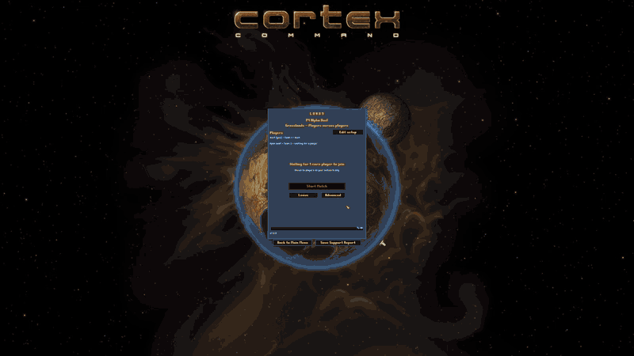

<sub>Recorded by the game's own frame capture on the current build.</sub>

</div>

---

> [!NOTE]
> **Status, October 10.** Builds and plays on Windows, macOS and Linux. The netcode holds: four machines on three operating systems, one of them on a phone hotspot through the relay, ran 23 minutes with every machine hash-identical every tick at 60 ticks per second. What is still rough is the match itself: placing a brain with the mouse, the buy menu, the rematch screen. Those fixes and the "one laggy player must not stall the others" work are in progress on the `cm-wip/*` branches and land on `cm-dev` as they pass. The first alpha is tagged when a full game over the relay passes with all of that in.
>
> The current build is `cm-dev`; `main` is the snapshot of October 4 and catches up when that first game passes. The pictures below are from `cm-dev`.
>
> The whole list is in [Known issues](#known-issues).

## What you get

| | |
|---|---|
| **Host or join from the menu** | A built-in game list. Host, pick the game on the other machine, play. No port forwarding. |
| **Your soldier answers right away** | Your own soldier is drawn from a preview that runs ahead of the network, so a press shows the instant you make it. |
| **Any OS with any OS** | Every machine runs the exact same simulation, bit for bit. Windows, macOS and Linux in one match is the normal case. |
| **Leave and come back** | Drop out, crash, close the game: the AI holds your seat and your soldiers keep fighting. Rejoin while the match runs. |
| **The host stays in charge** | The Players panel shows every seat and why it is held. The host can hand a held seat to a newcomer, kick or ban. Nobody loses a seat without the host's click. |
| **Autosave and resume** | The host sets a checkpoint interval for the whole match. Everyone can resume it from disk later, even if the host's machine died. |
| **Persistent worlds** | A match that keeps running while people join and leave. Latecomers watch, then take a seat when one opens. |
| **Your mods, unchanged** | Mods run as they always did. Void Wanderers is part of the test set. |
| **Direct first, relay when needed** | Peer-to-peer whenever the internet allows it. When it does not, a Cloudflare relay takes over on its own. Nothing to enter. |

---

## Play in five minutes

> No second player handy? [Run a host and a client side by side on one Windows PC](docs/handtest.md).
>
> **Both players need the same version and the same mods.** The version is printed at the bottom left of the main menu and in `VERSION.txt` beside the game. If a join is refused as "modules", the two `Data` folders differ: same mods, same versions, on both sides.

<details>
<summary><b>Windows</b></summary>

1. Get the build. Packaged alphas appear on the [Releases](https://github.com/Madreag/cortex-modern/releases) page as they are cut; until then build from source ([Building](#building)) or take a zip a friend built from the same version.
2. Unpack anywhere, start `Cortex Command.exe`. If SmartScreen asks, **More info → Run anyway**.
3. **Host:** Main Menu → **Multiplayer** → type your name → **Host Game** → pick the activity, scene and number of players → **Create Lobby**.
4. **Join:** Main Menu → **Multiplayer** → type your name → **Join Game** → pick the match from the list (or type the host's address and port) → **Connect**.
5. In the lobby every joining player presses **Ready**, then the host presses **Start Match**. In the match, **F6** (or **Players** in the pause menu) opens the Players panel. The badge in the corner shows your connection (Good with your round trip, Unsteady, Inputs affected, Reconnecting), and the status box says what is happening, with input delay, round trip and pace when it is set to show them.

</details>

<details>
<summary><b>macOS</b></summary>

1. Get the build (see Windows, step 1). Unpack the app.
2. On first launch macOS may block an unsigned app: **System Settings → Privacy & Security → Open Anyway**, then launch again.
3. Host or join exactly as on Windows.
4. The first time you host, macOS asks whether the game may accept incoming connections: allow it.

</details>

<details>
<summary><b>Linux</b></summary>

1. Get the build (see Windows, step 1). Unpack the tarball; if the executable lost its permission, `chmod +x CortexCommand`.
2. Launch from the unpacked folder so the game finds `Data`.
3. Host or join exactly as on Windows.

</details>

**If something is off**

- *Nobody can see my match.* The game list comes from the directory service at `directory.broserver.com`. If it is down, the host shares its address and port and players type them into Join Game.
- *The status box says the connection is relayed.* With **Connection** on *Automatic*, no direct route came through, so the game went over the relay. It costs nothing. To insist on direct, set **Settings → Network → Connection** to *Direct only* on both machines (then it may fail to connect at all).
- *A player's soldier is "held".* Their inputs stopped arriving (lag spike, alt-tab, a crash). The AI plays the seat until they are back. The Players panel (F6) says why.
- *Everything slowed down when someone joined.* It should not. That is a bug: see [Reporting a bug](#reporting-a-bug).

---

## The menus and screens

| | |
|---|---|
| 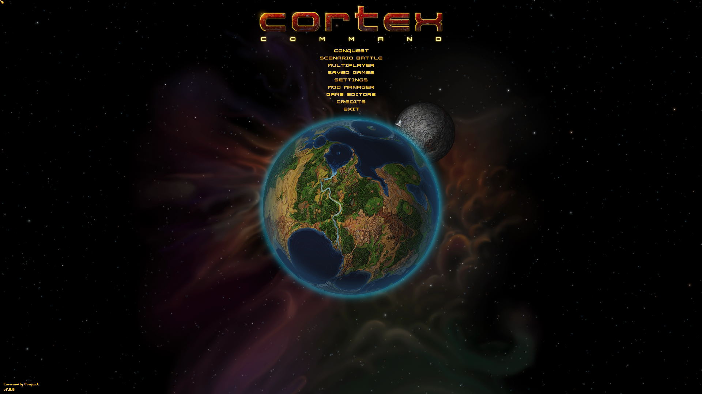 | **Main menu.** **Multiplayer** sits between Scenario Battle and Saved Games. The version line at the bottom left names the base game, the multiplayer version and the network protocol (7 right now). |
| 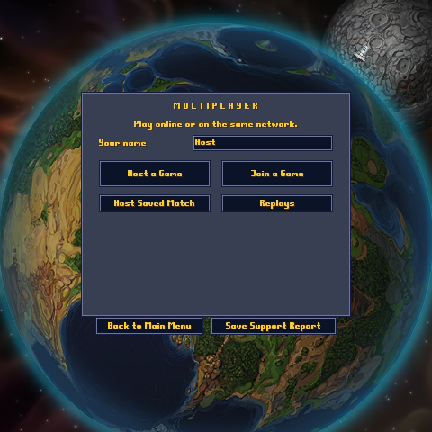 | **Multiplayer.** Your name, then **Host a Game** and **Join a Game**, with **Host Saved Match** and **Replays** below. If a match of yours is still running, **Rejoin Match** appears above them: your seat is held until the host gives it away. |
| 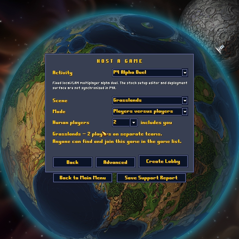 | **Host a Game.** Four rows: the activity, the scene, the mode, how many people play. One line sums the match up and says who can find it. **Create Lobby** opens it; the port, the delay, the router and the listing sit behind **Advanced**. |
| 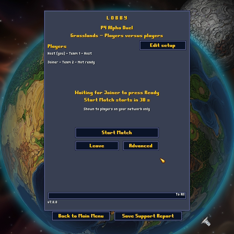 | **Lobby.** Every player and AI team with its state, and one line saying who is waited for. Players press **Ready** and can take it back. The host presses **Start Match**: at once when everyone is ready, otherwise a 30-second countdown that everyone sees and the host can cancel. |
| 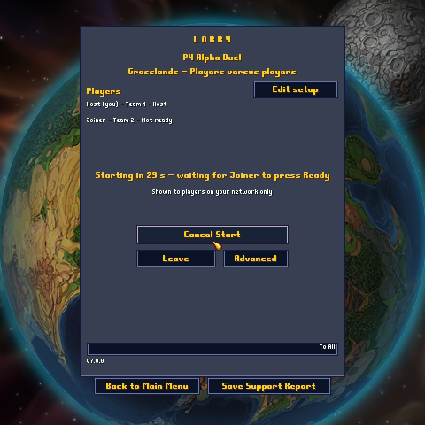 | **Start countdown.** The host pressed **Start Match** before everyone was ready. Every screen counts down from 30; the host's button reads **Cancel Start** until the start goes out; the last **Ready** starts the match at once. |
| 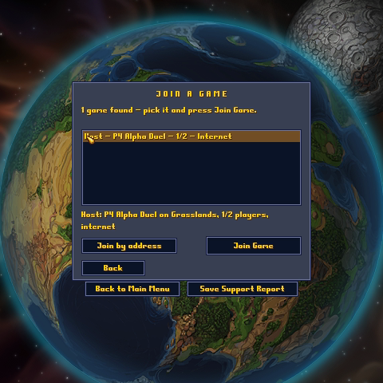 | **Join a Game.** The game list: host, activity, players, LAN or internet, and the reason when a game cannot be joined. Select one and press **Join Game**, or double-click it. **Join by address** takes a host's address and port. |
| 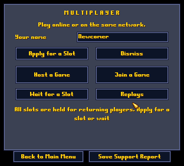 | **Asking for a seat.** When every seat of a running world is held for its returning players, a newcomer can **Apply for a Slot** (the host decides) or **Wait for a Slot**. A player whose own seat is held gets **Apply to Rejoin**. |
| 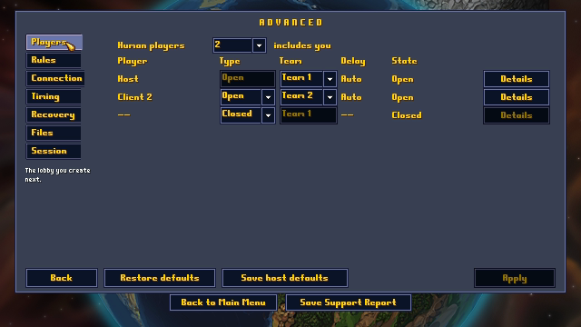 | **Advanced.** The host's full options on seven pages: Players, Rules, Connection, Timing, Recovery, Files and Session. Changes wait for **Apply**; **Back** drops them; lists mark their standard choice **(default)**. **Players** lists each seat with its team and state. |
| 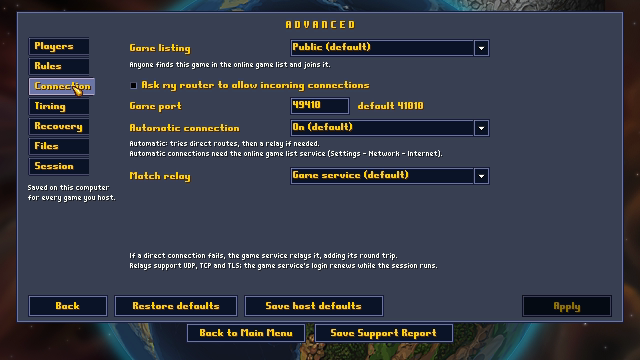 | **Advanced: Connection.** **Game listing** (Public, Unlisted or Local discovery), asking your router to open the port (on by default), the **Game port**, **Automatic connection** for players behind home routers, and the **Match relay** (Off, Game service, Custom relay). Every row has a one-line hint. |
| 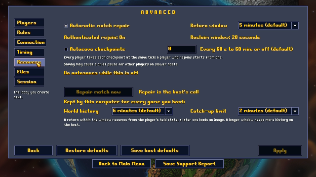 | **Advanced: Recovery.** Automatic match repair, the **Return window** for a dropped player, authenticated rejoin, **Autosave checkpoints** every 60 seconds to 60 minutes or off, **World history** and the **Catch-up limit** for persistent worlds, **Repair match now** while a match runs. |
| 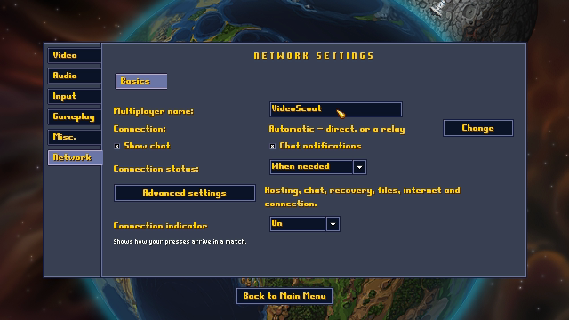 | **Settings → Network.** Your name, your **Connection** (Automatic, Direct only, Relay only), the chat switches and when the connection badge shows. **Advanced settings** has the rest: delay, recovery, files, the online game list, the STUN list and your own relay. |
| 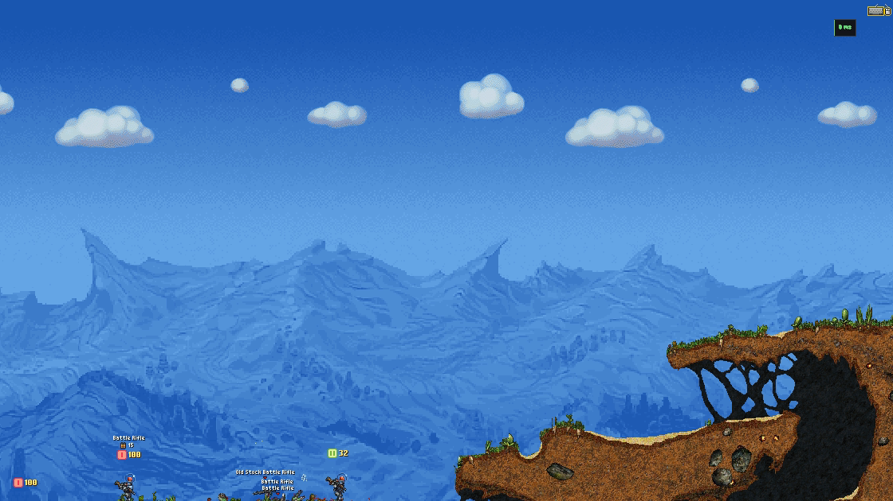 | **In the match.** The badge in the corner: Good with your round trip in ms, Unsteady, Inputs affected, or Reconnecting. The status box (Off, When needed or Always) says what is happening: input delay in ticks and milliseconds, the round trip to the host or the slowest peer, and the pace in ticks per second. |
| 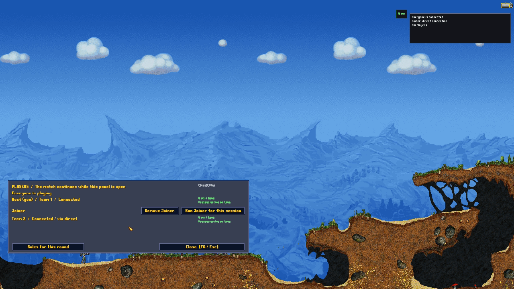 | **The Seats panel (F6).** Each player with their connection quality, held seats and why, applications for a seat, kick and ban. The match keeps running while it is open. |

Not pictured: a seat's details, the joined player's read-only **Match details**, **Replays**, **Host Saved Match**, the post-match summary with rematch.

---

## How it works

Every player runs the same deterministic simulation. Only controller inputs cross the network, never terrain or objects. Your own soldier is drawn from a preview that runs up to 20 ticks ahead of the lockstep, so your presses show immediately; the real match confirms them a few frames later. This is the architecture the Community Project asked for: controllers on the wire, AI on every machine, no fixed-point math, standardized floating point so Windows, macOS and Linux agree to the bit.


**Input delay.** Inputs are sent for a tick a little in the future, sized per connection from its round trip plus a jitter margin and resized as the link changes (about 10 ticks at 80 ms). Each packet carries the last few ticks of inputs again, so a lost packet costs nothing. As long as inputs land inside that window, nobody waits on the wire.

**A laggy player.** Today, when a player's inputs stop past the window, the others wait, and after five seconds of silence that seat is handed to the AI on every machine at the same frame and the match goes on. The piece being finished now shortens that wait to a few ticks, bridges the seat silently, and brings the player back on their own once their inputs return, so a bad connection is that player's problem and nobody else's.

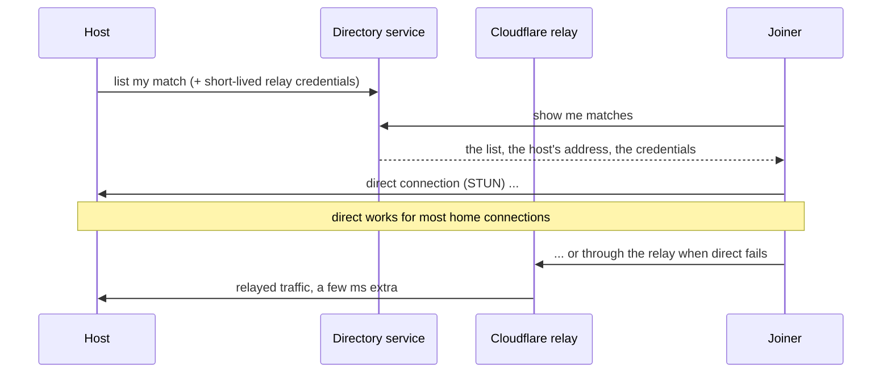

**Connections.** The directory service lists matches and mints short-lived relay credentials, so the game never holds a long-lived key. A connection tries a direct route first (three public STUN servers are preconfigured). When no direct route completes, the Cloudflare relay carries the match. You set nothing. **Settings → Network** can force *Direct only* or *Relay only*, change the STUN list, or point at your own relay. Running your own relay: [`docs/turn-relay.md`](docs/turn-relay.md).

---

## Connections: direct, relay and your options

| Setting | Where | What it does |
|---|---|---|
| **Connection: Automatic** (default) | Settings → Network | Direct first; the relay only when no direct route completes. |
| **Connection: Direct only** | Settings → Network | Never uses a relay. Lowest latency; may fail behind strict routers. |
| **Connection: Relay only** | Settings → Network | Always relays. For when direct connections keep dropping. |
| **STUN servers** | Settings → Network | How your public address is discovered. Three public servers preconfigured, editable. |
| **Your own relay** | Settings → Network; Host a Game → Advanced → Connection | A fixed relay address, username and password, for players who run their own TURN server. |
| **Automatic connection** | Host a Game → Advanced → Connection | Lets players behind home routers reach the host directly (STUN). Off means the host's port must be forwarded. |
| **Match relay** | Host a Game → Advanced → Connection | Off, **Game service** (the default: the directory's relay) or **Custom relay** (TURN). |

---

## Mods

Mods work unchanged. Scripts, saves and data files behave as they do in the Community Project build this fork is based on. Where the 7.0 base removed script functions that older mods still call, this fork keeps those names working with their old meaning (the ones Void Wanderers uses are covered; the full set is on the roadmap).

Void Wanderers, the most-played mod, is part of the test set: it is played in single player and in multiplayer before a build ships.

---

## What's in Alpha 1

| Feature | How it is tested |
|---|---|
| Two to four players over the internet, host or join from the menu | Matches across five machines and three operating systems; the last one 23 minutes, four machines, host on a phone hotspot through the relay, every tick hash-identical |
| Your own input shown immediately | The local preview, measured with 100 and 200 ms of artificial lag plus jitter and loss |
| Leave, crash, rejoin; the AI holds the seat | Drop, rejoin and repair scenes with frame capture |
| Host loss: the match continues on a new host | Host-loss and migration scenes |
| Checkpoints and resume from disk for the whole match | Resume scenes; both peers killed and reloaded |
| Persistent worlds with late joiners and watchers | World join, world restart and segment tests |
| Host moderation: seats, applications, kick, ban | Moderation scenes with frame capture |
| Direct connection with STUN; Cloudflare relay fallback; your own relay | Relay comparison, relay-only matches, a relay soak with credential renewal, the hotspot match |
| Saves from the original game and from earlier builds load, play and save again | Old-save tests on Windows and Linux |
| Windows, macOS and Linux in one match | Cross-platform determinism tests on every build |
| Mods unchanged, Void Wanderers tested | The mod battery and the Void Wanderers scenes |

---

## Known issues

Alpha means alpha. Everything below is tracked; *being fixed* means someone is on it now.

| Issue | What you would see | State |
|---|---|---|
| Placing a brain by mouse in a match | A plain click on a valid spot does not always install the brain; the message does not say why. | **Being fixed** |
| The buy menu in a match | The pie menu may show only a locked bag, and Buy may not open for the soldier you control. | **Being fixed** |
| The rematch screen | After a match the host sees a "Start Match starts in 30 s" line while no countdown runs. | **Being fixed** |
| Closing the game after a match | On one platform the game did not exit within 10 seconds of closing the window. | **Being fixed** |
| A laggy player can stall the others | Inputs that stop past the delay window make the others wait, up to five seconds, before the AI takes the seat. | **Being fixed** |
| A refused join says only "modules" | Two players whose game data differ by a single byte cannot join each other, and the message does not name the mod. Both need identical `Data` folders. | Open |
| Autosave on a slow host | With checkpoints on, a 2014-class 4-core host pauses everyone about 40 ms once per save. The target is one frame. | **Being fixed** |
| Hour-long worlds | Memory use grows over a long persistent world. Being measured to tell a leak from a cache that stops growing. | Being measured |
| Mobile data | Four players with the host on LTE through the relay: proven for 23 minutes, with the relay login renewing mid-match. Host loss over mobile data: not proven yet. | Being tested |
| Your stop may show a fraction late, rarely | On a joined machine, in moments that depend on randomness (debris at your feet), your own stop can show one input delay late: 1 to 3 times in 32 in a heavy-debris test. | Under review |
| A joiner can pause a busy world for a moment | Joining a busy persistent world on a loaded host shows everyone a pause of about a third of a second while the snapshot is taken. | Next alpha |
| Mac hosts write checkpoints slowly | A joiner of a Mac-hosted world waits about 5 seconds for the snapshot instead of 2. | Next alpha |
| Held seat between rounds | A newcomer cannot apply for a dropped player's seat between rounds, only during play. | **Being fixed** |
| Watching a brand-new world | A watcher joining a world created moments ago gets no status line. | Next alpha |

---

## Roadmap

Public names first; the names used inside the project in parentheses.

| Release | Contents |
|---|---|
| **Alpha 1** (V1) `0.1.0-alpha.1` | Everything in [What's in Alpha 1](#whats-in-alpha-1). Tagged when one complete game over the relay passes with the in-match fixes in, every player action having gone through the scripted scenes on two machines first. **In progress.** |
| **Alpha 2** (V1.1) `0.2.0-alpha.N` | The known issues above; bandwidth per player measured and shown in the host options; the Wait and Pause slow-player policies; a sound check across players; hour-long matches with checkpoints; faster checkpoint compression for Mac hosts; Mac and Linux packaging; the directory service on a dedicated host; short room codes for private games. |
| **Beta** (V1.5) `0.3.0-beta.N` | More than four players (up to 32); team members with the Brains option; a per-mod compatibility profile; CI-built, signed packages. |
| **1.0** | The released product. |
| **1.1** (V2) | Other players' soldiers shown where they will be, not where they were: presentation prediction without rewinding the match. The full set of old mod function names. |
| **Later** (V3) | True rollback (predicting other players' inputs and re-simulating). Only if 1.1 is not enough. |

---

## Branches and releases

- `main`: the snapshot a plain clone gives you (October 4 as of this writing). It moves only when a full game passes on `cm-dev`.
- `cm-dev`: the integration branch. Every change lands here first, reviewed and built on all three platforms.
- `cm-wip/*`: work in progress, one branch per piece: `relay-foolproof` (the laggy-player work), `restore-cost` (the autosave pause), `in-match-fight15` (the in-match fixes).
- Upstream's `development` is merged in from the Community Project's repository as needed.
- Releases will be tags with packages for the three operating systems, checksums and the matching source. Pre-releases are flagged, so "latest" never points at an alpha.

---

## Building

Multiplayer needs the GameNetworkingSockets library (GNS), built with the small patch in `external/patches/` (it keeps a relay login alive for the length of a match). A build without GNS is single-player only.

<details>
<summary><b>GNS, all platforms</b></summary>

`external/patches/build_gns_turn.py` fetches the pinned GNS checkout, applies `gns-turn-lifetime.patch` and builds and installs it:

```sh
python external/patches/build_gns_turn.py --repo <this tree> --source <where to clone GNS> --build <build dir> --install <install prefix> --out <log dir>
```

On Windows pass `--dependency <vcpkg x64-windows install dir>` for protobuf, Abseil and OpenSSL. The install prefix is what `GNS_ROOT` (Windows) or `-Dgns_root` (meson) point at.

</details>

<details>
<summary><b>Windows (Visual Studio)</b></summary>

1. Install [Visual Studio 2022](https://visualstudio.microsoft.com/downloads/) with the C++ workload (the Build Tools alone work), and the x64 [Visual C++ Redistributable](https://support.microsoft.com/en-us/help/2977003/the-latest-supported-visual-c-downloads).
2. Clone this repository. The default branch, `main`, is the alpha.
3. Build GNS as above. Set `GNS_ROOT` to the install prefix and `GNS_DEP_ROOT` to vcpkg's `x64-windows` directory (`RTEA.vcxproj` reads both). GNS links statically; protobuf, Abseil and OpenSSL are shared.
4. Copy `fmod.dll` from `external\lib\win`, and `libprotobuf.dll`, `abseil_dll.dll` and `libcrypto-3-x64.dll` from `%GNS_DEP_ROOT%\bin`, next to `Cortex Command.exe`. Use the DLLs from the same dependency build you linked against.
5. Open `RTEA.sln`, choose x64 and a configuration, build and run.
   - `Debug Full`: debugging with all visuals (builds fast, runs slow).
   - `Debug Minimal`: debugging with visuals off.
   - `Debug Release`: debugger-enabled optimized build.
   - `Final`: the release executable.

</details>

<details>
<summary><b>Linux and macOS (meson)</b></summary>

Dependencies: `meson` (0.60+), `ninja`, a C++20 compiler (GCC 13 or Clang 18 are what the test machines use), and the libraries the Community Project lists: `allegro4`, `boost`, `flac`, `libpng`, `luajit`, `minizip`, `lz4`, `libtbb`, `fmod`, plus GNS for multiplayer.

```sh
git clone https://github.com/Madreag/cortex-modern.git
cd cortex-modern
meson setup build --buildtype=release -Dwith_gns=enabled -Dgns_root=<GNS install prefix>
ninja -C build
```

On macOS point `CC`/`CXX` at Homebrew's gcc-13 and put protobuf's and OpenSSL's `pkgconfig` directories on `PKG_CONFIG_PATH` before `meson setup`. Run from the repository root so the game finds `Data`. `meson_options.txt` lists the options.

</details>

<details>
<summary><b>Windows Subsystem for Linux</b></summary>

The Linux build can be built and run on Windows 10/11 through WSL by following the Linux instructions. Building works directly from the Windows filesystem.

</details>

The full upstream build notes, including recommended Visual Studio plugins, debugging with VS Code and the SAST tools, are in the Community Project's [README](https://github.com/cortex-command-community/Cortex-Command-Community-Project#readme).

---

## Contributing

This fork follows the Community Project's engineering rules: controller-sync multiplayer (never deterministic AI), standardized floating point for cross-platform determinism (never expanded fixed-point), and small, single-purpose commits. Changes that would break existing mods are not accepted; the engine is fixed instead.

Issues and pull requests are welcome here. Changes that belong upstream are prepared as focused pull requests to the Community Project once they are proven here. The rules and the checks to run first are in [CONTRIBUTING.md](CONTRIBUTING.md).

## Reporting a bug

Open an issue with:

1. The version line from the bottom left of the main menu (also `VERSION.txt` beside the game).
2. Your operating system and the other players' operating systems.
3. What the badge showed, and whether the status box said the connection was relayed.
4. **Save Diagnostics** (the button under the Multiplayer and Host screens, also in Settings → Network): attach what it saves. Check the bundle for anything you consider private before attaching it.

For anything that could be used against other players, use the private route in [SECURITY.md](SECURITY.md) instead of a public issue.

## Credits and license

Cortex Command is by Data Realms. The [Cortex Command Community Project](https://github.com/cortex-command-community/Cortex-Command-Community-Project), maintained by Causeless and the community, is the base this fork builds on, and its architectural direction for multiplayer is the one implemented here.

Cortex Modern is Free/Libre and Open Source under the GNU AGPL v3, like the project it forks: see [LICENSE](LICENSE). Third-party notices are in [`Licences/`](Licences/).
