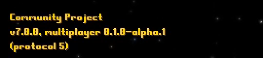
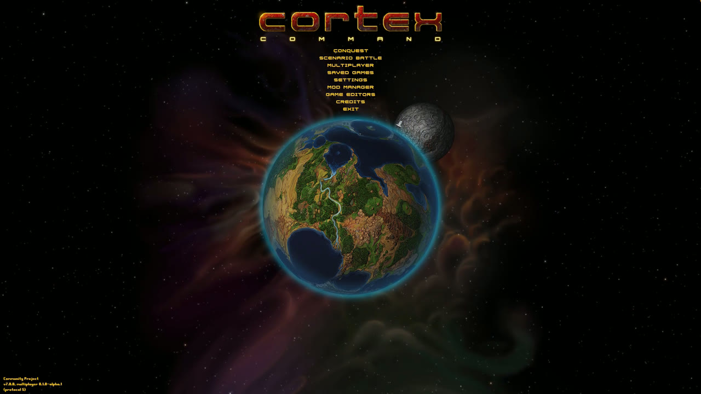
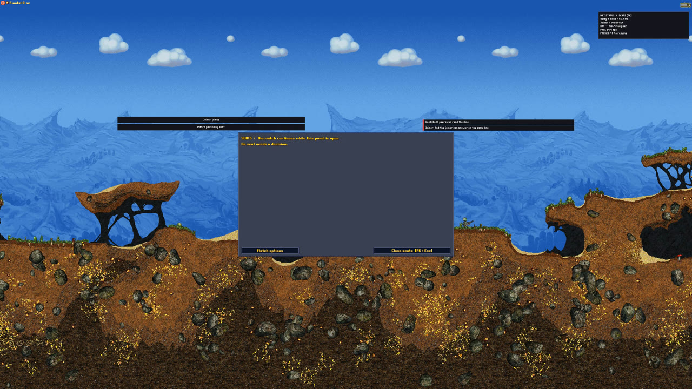
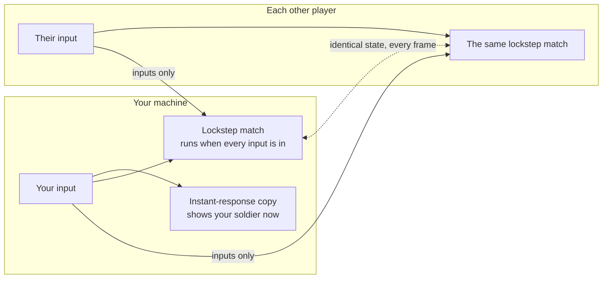
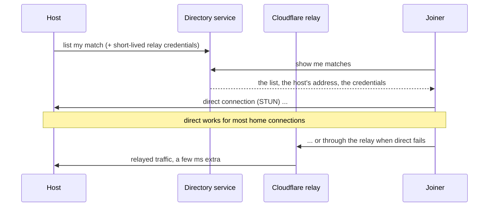

<div align="center">

# Cortex Modern

**Cortex Command with online multiplayer that feels like single player. Any OS with any OS.**

A community fork of the [Cortex Command Community Project](https://github.com/cortex-command-community/Cortex-Command-Community-Project) that adds internet play: host or join from the main menu, your own soldier answers instantly, nobody waits for anybody's connection, and the mods you already have keep working.

[](#whats-in-alpha-1)
[](VERSION.txt)
[](#play-in-five-minutes)
[](https://github.com/cortex-command-community/Cortex-Command-Community-Project)
[](LICENSE)


<sub>Recorded by the project's own test recorder on the alpha build. Top right: the network overlay (input delay, route, pace).</sub>

</div>

---

> [!NOTE]
> **Alpha 1 status, October 4.** Playable today, built from source on Windows, macOS and Linux. The full acceptance run on this exact build has not finished yet.
>
> **Being fixed right now**
> - A join refused as "modules" does not say which mod differs.
> - Memory use in hour-long persistent worlds is being measured.
>
> **Not proven yet**
> - On a phone hotspot, two-player matches work on LTE, both with Automatic and with Relay only. Four players, a relay login expiring mid-match and the host leaving mid-match are not proven over mobile data yet.
>
> The whole list is in [Known issues](#known-issues).

## What's new

| | | |
|---|---|---|
| 🌐 **Host or join from the menu** | A built-in game list. Host a game, pick it from the list on the other machine, play. No port forwarding to set up. | [How to](#play-in-five-minutes) |
| ⚡ **Feels like single player** | Your own soldier answers the instant you press. A player with a bad connection or a slow machine never slows anyone else down. | [How it works](#how-it-works) |
| 🖥️ **Windows, macOS and Linux in one match** | Every machine runs the exact same simulation, bit for bit. Mixed-OS matches are a normal case, not a special one. | [How it works](#how-it-works) |
| 🔁 **Leave and come back** | Drop out, crash, or close the game: the AI holds your seat and your soldiers keep fighting. Rejoin while the match runs. | [Menus](#the-new-menus-and-screens) |
| 👑 **Host moderation** | The Players panel lists every player, a page at a time when they do not all fit, and why a place is held. While the match runs the host can hand a held seat to a newcomer, remove or ban a player. Nobody loses a seat without the host's click. | [Menus](#the-new-menus-and-screens) |
| 💾 **Autosave and resume** | The host sets a checkpoint interval for the whole match. A match can be resumed from disk by everyone, even after the host's machine died. | [Menus](#the-new-menus-and-screens) |
| 🌍 **Persistent worlds** | A match that keeps running while players join and leave. Latecomers watch, then take a seat when one opens. | [How it works](#how-it-works) |
| 🧩 **Your mods, unchanged** | Mods run exactly as before. Void Wanderers is part of the test set. | [Mods](#mods) |
| 🔌 **Direct connection first, relay when needed** | Direct peer-to-peer whenever the internet allows it. When it does not, a Cloudflare relay takes over by itself. Nothing to enter. | [Connections](#connections-direct-relay-and-your-options) |

---

## Play in five minutes

> No second player handy? [Run a host and a client side by side on one Windows PC](docs/handtest.md).
>
> **Both players need the same Cortex Modern version and the same mods.** The version is printed at the bottom left of the main menu and in `VERSION.txt` beside the game. If a join is refused as "modules", the two `Data` folders differ: the same mods in the same versions on both sides fixes it.
>
> 

<details>
<summary><b>Windows</b></summary>

1. Get the build. Packaged alpha builds appear on the [Releases](https://github.com/Madreag/cortex-modern/releases) page as they are cut; until then, build from source ([Building](#building)) or take the zip a friend built from the same version.
2. Unpack anywhere. Start `Cortex Command.exe`. If SmartScreen asks, choose **More info → Run anyway**.
3. **Host:** Main Menu → **Multiplayer** → type your name → **Host Game** → set the activity, scene and the number of players → **Create Lobby**.
4. **Join:** Main Menu → **Multiplayer** → type your name → **Join Game** → pick the match from the list (or type the host's address and port) → **Connect**.
5. When everyone is in the lobby, each joining player presses **Ready**, then the host presses **Start Match**. In the match, **F6** (or **Players** in the pause menu) opens the Players panel; the status box in the corner says what is happening, and with the detailed network statistics setting on, it adds input delay, round trip and pace.

</details>

<details>
<summary><b>macOS</b></summary>

1. Get the build (see Windows, step 1). Unpack the app.
2. On first launch macOS may block an unsigned app: **System Settings → Privacy & Security → Open Anyway**, then launch again.
3. Host or join exactly as on Windows: **Multiplayer → Host Game** or **Join Game**.
4. The first time you host, macOS asks whether the game may accept incoming connections: allow it.

</details>

<details>
<summary><b>Linux</b></summary>

1. Get the build (see Windows, step 1). Unpack the tarball; if the executable lost its permission, `chmod +x CortexCommand`.
2. Launch from the unpacked folder so the game finds its `Data` directory.
3. Host or join exactly as on Windows: **Multiplayer → Host Game** or **Join Game**.

</details>

**Troubleshooting**

- *Nobody can see my match.* The game list is served by the directory service at `directory.broserver.com`. If it is unreachable, the host can share its address and port, and players type them into Join Game.
- *We connect, but the status box says "connected through a relay".* With **Connection** on *Automatic*, your internet did not allow a direct route, so the game connected through the relay instead; with *Relay only* chosen, it always connects this way. It costs nothing. To insist on direct, set **Settings → Network → Connection** to *Direct only* on both machines (it may then fail to connect).
- *A player's soldier is "held".* Their inputs stopped arriving (lag spike, alt-tab, a crash). The AI plays the seat until they are back. The Players panel (F6) says why.
- *Everything got slower when someone joined.* It should not. If it did, it is a bug: see [Reporting a bug](#reporting-a-bug).

---

## The new menus and screens

| | |
|---|---|
|  | **Main menu.** **Multiplayer** sits between Scenario Battle and Saved Games. The version line at the bottom left names the base game, the multiplayer version and the network protocol. |
|  | **Multiplayer.** Your name, then **Host a Game** and **Join a Game**, with **Host Saved Match** and **Replays** below. When a match of yours is still running, a block above them offers **Rejoin Match**: your seat is held until the host gives it away. |
|  | **Host a Game.** Four rows: the activity with the first line of what it is, the scene, the mode in plain words and how many people play, you included. One line sums the match up and says who can find it. **Create Lobby** opens it; the port, the delay, the router and the listing are behind **Advanced**. |
|  | **Lobby.** Every player and AI team with its state, and one sentence saying who is waited for. Players press **Ready** and can take it back. The host presses **Start Match**: at once when everyone is ready, otherwise a 30-second countdown everyone sees starts, and the host can cancel it. A line says who can find the game. |
|  | **Start countdown.** The host pressed **Start Match** before everyone was ready: every screen counts down from 30 seconds; the host's names who is still to press **Ready**, and a player who has not pressed it is asked to. The host's button reads **Cancel Start** until the start goes out to the players; opening **Edit setup** stops the count, and the last **Ready** starts the match at once. |
|  | **Join a Game.** The screen is the game list: each game's host, activity and players, whether it is on this network or the internet, and the reason when it cannot be joined. Select a game and press **Join Game**, or double-click it. **Join by address** takes a host's address and port. |
|  | **Asking for a seat.** When every seat of a running world is held for its returning players, a newcomer is told so and offered **Apply for a Slot** (the host decides) or **Wait for a Slot**, which counts down while it waits. A player whose own seat is held is offered **Apply to Rejoin**. |
|  | **Advanced.** The host's full options, on seven pages chosen on the left: Players, Rules, Connection, Timing, Recovery, Files and Session. Changes wait for **Apply**; **Back** leaves them; on the Connection, Timing, Recovery, Files and Session pages a list marks its standard choice **(default)**. **Players** lists each seat with its team and state; **Details** opens a seat. |
|  | **Advanced: Connection.** **Game listing** (Public, Unlisted or Local discovery, each saying who can find the game), asking your router to open the port (on by default), the port, **Automatic direct connection** for players behind home routers, and **Relay fallback** when no direct route works. Every row has a one-line hint naming its consequence. |
|  | **Advanced: Recovery.** Automatic match repair; the **Return window** for a dropped player; authenticated rejoin; **Autosave checkpoints** every 60 seconds to 60 minutes, or off; **World history** and the **Catch-up limit** for persistent worlds; **Repair match now** while a match runs. |
|  | **Settings → Network.** Your name, your **Connection** (Automatic: direct, or a relay when no direct route works) with **Change**, the chat switches and when the connection status shows. **Advanced settings** opens the rest: delay, chat, recovery, files, the online game list, the STUN list and your own relay. |
|  | **In the match.** The overlay: input delay in ticks and milliseconds, your route (*via direct* or *via relay*), the slowest peer's round trip, and the pace. **F6** opens the seats panel: held seats and why, applications for a seat, kick and ban. |
|  | **The seats panel.** The match continues while it is open. Chat lines sit at the top of the screen; a toast names what just happened (a player joined, the match paused). |

Not pictured: a seat's details, the joined player's read-only **Match details**, **Replays** and **Host Saved Match**, the post-match summary with rematch, and the **Rejoin Match** offer on the Multiplayer menu when a match of yours is still running.

---

## How it works

Every player runs the same deterministic simulation. Only controller inputs cross the network. Your own soldier is shown through an instant-response copy of the match, so your presses are on screen immediately; a few frames later the real match confirms them. This is the architecture the Community Project asked for: controllers on the wire, AI on every machine, no fixed-point math, standardized floating point so Windows, macOS and Linux agree to the bit.



**A laggy player never slows the others.** If a player's inputs stop arriving past a bound the host sets, that player's seat is handed to the AI on every machine at the same frame, and the match goes on. When their inputs return, they catch up privately and take the seat back. Nobody else feels a thing.



**Connections.** The directory service lists matches and mints short-lived relay credentials, so the game never holds a long-lived key. Connections try a direct route first (three public STUN servers are preconfigured). When no direct route completes, the Cloudflare relay carries the match. You set nothing. If you want, **Settings → Network** lets you force *Direct only* or *Relay only*, change the STUN list, or point at your own relay server. Hosts can run their own relay too: see [`docs/turn-relay.md`](docs/turn-relay.md).

---

## Connections: direct, relay and your options

| Setting | Where | What it does |
|---|---|---|
| **Connection: Automatic** (default) | Settings → Network | Direct first; the relay only when no direct route completes. Best performance when direct works, no setup when it does not. |
| **Connection: Direct only** | Settings → Network | Never uses a relay. Lowest latency; may fail behind strict routers. |
| **Connection: Relay only** | Settings → Network | Always relays. Use when direct connections keep dropping. |
| **STUN servers** | Settings → Network | How your public address is discovered. Three public servers preconfigured, editable. |
| **Your own relay** | Settings → Network; Host a Game → Advanced → Connection | A fixed relay address, username and password, for players who run their own TURN server. |
| **Automatic direct connection (STUN)** | Host a Game → Advanced → Connection | Lets players behind home routers reach the host's match directly. Off means players need the host's port forwarded. |
| **Relay fallback (TURN)** | Host a Game → Advanced → Connection | Off, **Game service** (the default: the directory's relay, Cloudflare when configured), or **Custom relay**. |

---

## What makes this different

- **Single-player feel over the internet.** Tested with 100 and 200 ms of artificial lag plus jitter and packet loss: your own input is never delayed, and the fast player never waits for the slow one.
- **Cross-platform lockstep that actually holds.** The simulation is bit-identical across Windows, macOS and Linux, checked by hashing every subsystem every frame on every machine in the test set.
- **Nothing is lost when something goes wrong.** Drops, crashes, host loss, a dead host machine: the AI holds seats, the match migrates to a new host, checkpoints resume from disk, and players rejoin while play continues.
- **The host stays in charge.** Seats, applications, kick, ban, autosave, slow-player policy, repair policy: all host options, each with a hint.
- **Mods are untouched.** No opt-in flags, no patched mods, no rewrites. The engine was fixed wherever a mod and multiplayer disagreed.

---

## Mods

Existing mods work unchanged. Scripts, saves and data files behave as they do in the Community Project build this fork is based on. Where the 7.0 base had removed script functions that older mods still call, this fork keeps those names working with their old meaning (the functions Void Wanderers uses are covered; the full set of old names is on the roadmap).

Void Wanderers, the most-played mod, is part of the test set: it is played in single player and in multiplayer on every machine before a build ships.

---

## What's in Alpha 1

| Feature | Proof in the test set |
|---|---|
| Two to four players over the internet, host or join from the menu | Multi-machine matches on five machines and three operating systems |
| Your own input never delayed; a laggy player stalls nobody | Feel measurements at 100 and 200 ms with jitter and loss |
| Leave, crash, rejoin; the AI holds the seat | Drop, rejoin and repair scenes, on video |
| Host loss: the match continues on a new host | Host-loss and migration scenes |
| Checkpoints and resume from disk for the whole match | Resume scenes; both peers killed and reloaded |
| Persistent worlds with late joiners and watchers | World join, world restart and segment tests |
| Host moderation: seats, applications, kick, ban | Moderation scenes, on video |
| Direct connection with STUN; Cloudflare relay fallback; your own relay | Relay comparison and relay-only matches, and a phone-hotspot session on LTE |
| Saves from the original game and from earlier builds load, play and save again | Old-save tests on Windows and Linux |
| Windows, macOS and Linux in one match | Cross-platform determinism tests on every build |
| Mods unchanged, Void Wanderers tested | The mod battery and the Void Wanderers scenes |

---

## Known issues

Alpha means alpha. Everything below is tracked; items marked *being fixed* have someone on them today.

| Issue | What you would see | State |
|---|---|---|
| A refused join says only "modules" | Two players whose game data differ by a single byte cannot join each other, and the message does not say which mod differs. Both need identical `Data` folders. | **Being fixed** |
| A relayed connection can give up early | Setting up a relayed connection over a slow path can take longer than the 10 seconds it is given. Trying again, or Automatic, gets through. | **Being fixed** |
| Hour-long worlds | Memory use grows over a long persistent world. Being measured to tell a leak from a cache that stops growing. | **Being measured** |
| Mobile data | Two players: proven on LTE, direct and through the relay. Four players, relay login renewal and host loss over mobile data: not proven yet. | Being tested |
| Your stop may show a fraction late, rarely | On a joined machine, in moments that depend on randomness (debris at your feet), your own stop can show one input delay late: 1 to 3 times in 32 in a heavy-debris test. | Under review |
| A joiner can pause a busy world for a moment | When someone joins a busy persistent world on a loaded host, everyone can see a pause of about a third of a second while the snapshot is taken. | Next alpha |
| Mac hosts write checkpoints slowly | A joiner of a Mac-hosted world waits about 5 seconds for the snapshot instead of 2. | Next alpha |
| Held seat between rounds | A newcomer cannot apply for a dropped player's seat between rounds, only during play. | Next alpha |
| Watching a brand-new world | A watcher joining a world created moments ago gets no status line. | Next alpha |
| Autosave on a slow host | A 2014-class host with checkpoints on can give others a brief pause once per save. | Next alpha |

---

## Roadmap

Public names first; the names used inside the project in parentheses.

| Release | Contents |
|---|---|
| **Alpha 1** (V1) `0.1.0-alpha.1` | Everything in [What's in Alpha 1](#whats-in-alpha-1), with zero known bugs on the full test run. **In progress.** |
| **Alpha 2** (V1.1) `0.2.0-alpha.N` | The known issues above; bandwidth per player measured and shown in the host options; the Wait and Pause slow-player policies; a sound check across players; hour-long matches with checkpoints; faster checkpoint compression for Mac hosts; Mac and Linux packaging; the directory service on a dedicated host; short room codes for private games. |
| **Beta** (V1.5) `0.3.0-beta.N` | More than four players (up to 32 in one match); team members with the Brains option; a per-mod compatibility profile; CI-built, signed packages. |
| **1.0** | The released product. |
| **1.1** (V2) | Other players' soldiers shown where they will be, not where they were: presentation prediction without rewinding the match. The full set of old mod function names. |
| **Later** (V3) | True rollback (predicting other players' inputs and re-simulating). Only if 1.1 is not enough. |

---

## Branches and releases

- `main`: the alpha. A plain clone gives you this branch, and this README describes it.
- `cm-dev`: the integration branch. Every change lands here first, reviewed and built, and `main` is fast-forwarded from it.
- `development`: the Community Project's upstream branch, untouched, kept for merging their work in.
- Releases will be tags with packages for the three operating systems, checksums and the matching source. Pre-releases are flagged, so "latest" never points at an alpha.

---

## Building

Multiplayer needs the GameNetworkingSockets library (GNS). A build without it is single-player only.

<details>
<summary><b>Windows (Visual Studio)</b></summary>

1. Install [Visual Studio Community](https://visualstudio.microsoft.com/downloads/) 2019 (16.10 or newer) or 2022 with the C++ workload, and both x86 and x64 [Visual C++ Redistributables](https://support.microsoft.com/en-us/help/2977003/the-latest-supported-visual-c-downloads).
2. Clone this repository. The default branch, `main`, is the alpha.
3. [Build GNS with its vcpkg dependencies](https://github.com/ValveSoftware/GameNetworkingSockets/blob/master/BUILDING.md) for `x64-windows`. Point `GNS_ROOT` at the GNS install prefix and `GNS_DEP_ROOT` at vcpkg's `x64-windows` install directory (`RTEA.vcxproj` reads them). The project links `GameNetworkingSockets_s.lib` statically, with shared protobuf, Abseil and OpenSSL dependencies.
4. Copy `fmod.dll` from `external\lib\win`, and `libprotobuf.dll`, `abseil_dll.dll` and `libcrypto-3-x64.dll` from `%GNS_DEP_ROOT%\bin`, into the root directory beside `Cortex Command.exe`. Use DLLs from the same dependency build used at link time. A static GNS build does not need `GameNetworkingSockets.dll`.
5. Open `RTEA.sln`, choose x64 and a configuration, build and run.
   - `Debug Full`: debugging with all visuals (builds fast, runs slow).
   - `Debug Minimal`: debugging with visuals off.
   - `Debug Release`: debugger-enabled optimized build.
   - `Final`: the release executable.

</details>

<details>
<summary><b>Linux and macOS (meson)</b></summary>

Dependencies: `meson` (0.60+), `ninja`, a C++17 compiler (GCC 11+ or Clang 13+), and the libraries the Community Project lists: `allegro4`, `boost`, `flac`, `libpng`, `luajit`, `minizip`, `lz4`, `libtbb`, `fmod`, plus GNS for multiplayer.

```sh
git clone https://github.com/Madreag/cortex-modern.git
cd cortex-modern
meson setup build --buildtype=release
ninja -C build
```

Run from the repository root so the game finds `Data`. `meson_options.txt` lists the options (install type, debug symbols).

</details>

<details>
<summary><b>Windows Subsystem for Linux</b></summary>

The Linux build can be built and run on Windows 10/11 through WSL by following the Linux instructions. Building works directly from the Windows filesystem.

</details>

The full upstream build notes, including recommended Visual Studio plugins, debugging with VS Code and the SAST tools, are in the Community Project's [README](https://github.com/cortex-command-community/Cortex-Command-Community-Project#readme).

---

## Contributing

This fork follows the Community Project's engineering rules: controller-sync multiplayer (never deterministic AI), standardized floating point for cross-platform determinism (never expanded fixed-point), and small, single-purpose commits. Changes that would break existing mods are not accepted; the engine is fixed instead.

Issues and pull requests are welcome here. Changes that belong upstream are prepared as focused pull requests to the Community Project once they are proven here. The rules and the checks to run first are in [CONTRIBUTING.md](CONTRIBUTING.md).

## Reporting a bug

Open an issue with:

1. The version line from the bottom left of the main menu (also `VERSION.txt` beside the game).
2. Your operating system and the other players' operating systems.
3. The connection mode the overlay showed: *via direct* or *via relay*.
4. **Save Diagnostics** (the button under the Multiplayer and Host screens, also in Settings → Network): attach the diagnostics it saves. Check the bundle for anything you consider private before attaching it.

For anything that could be used against other players, use the private route in [SECURITY.md](SECURITY.md) instead of a public issue.

## Credits and license

Cortex Command is by Data Realms. The [Cortex Command Community Project](https://github.com/cortex-command-community/Cortex-Command-Community-Project), maintained by Causeless and the community, is the base this fork builds on, and its architectural direction for multiplayer is the one implemented here.

Cortex Modern is Free/Libre and Open Source under the GNU AGPL v3, like the project it forks: see [LICENSE](LICENSE). Third-party notices are in [`Licences/`](Licences/).
